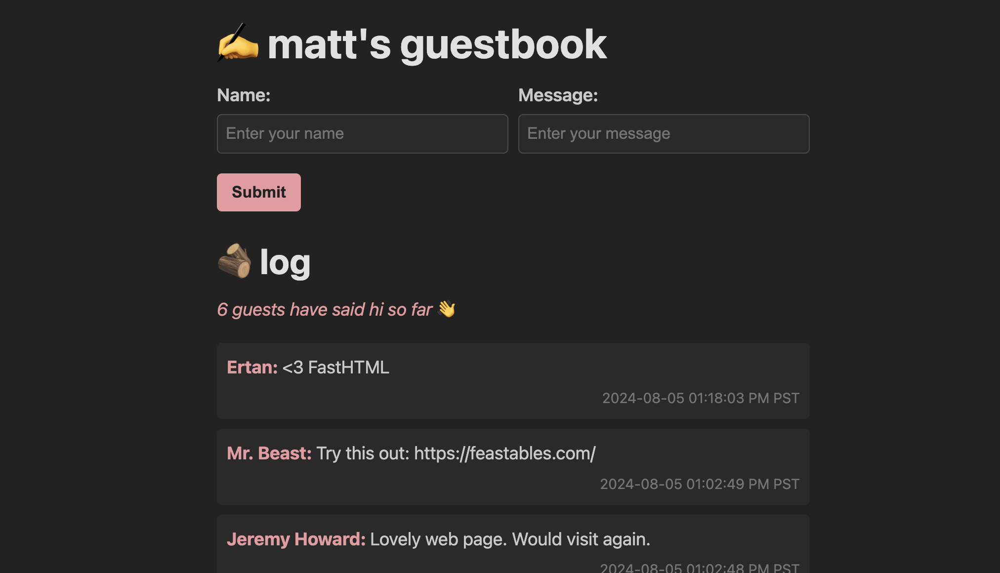

# Matt's Guestbook

A simple, real-time guestbook application built and deployed with:

- [FastHTML](https://fastht.ml): A Python framework for building HTML applications
- [HTMX](https://htmx.org): For seamless AJAX requests and updates
- [Replit](https://replit.com): Online IDE and hosting platform
  - [Replit Database](https://docs.replit.com/cloud-services/storage-and-databases/replit-database#what-is-replit-database): Key-value store for message persistence

Say hi: [https://guestbook.mattpalmer.io](https://guestbook.mattpalmer.io) or [follow along](x.com/mattppal) for more!

  

## Setup

1. Fork the [Replit project](https://replit.com/@matt/FastHTML-guestbook?v=1#main.py)
2. Click the "Run" button at the top of the Replit interface
3. The application will start, and you can access it via the provided URL

That's it!

## Configuration

1. Update the `MAX_NAME_CHAR` and `MAX_MESSAGE_CHAR` constants in `main.py` if you want to change input limits
2. Modify the `TIMESTAMP_FMT` constant to change the timestamp format
3. Adjust the styling in `style.css` to customize the appearance
4. The Replit database is used for storing messages (`from replit import db`). 
   1. You can easily swap this with Postgres / SQLite if you'd prefer an alternative.

